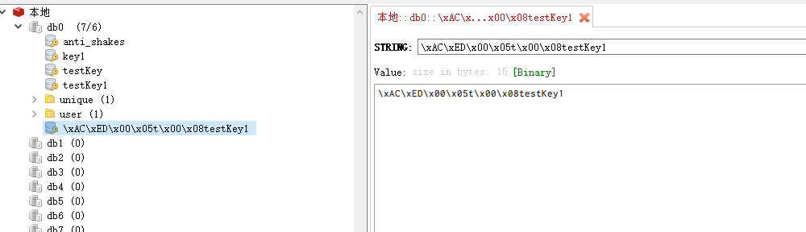
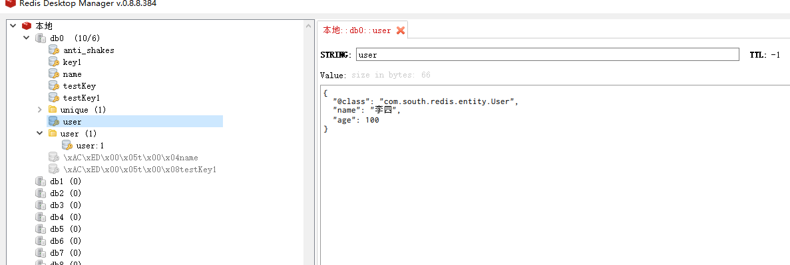

# 一、认识NoSQL

SQL：关系型数据库

NoSQL：非关系型数据库

|          | SQL                                                          | NoSQL                                                        |
| -------- | ------------------------------------------------------------ | ------------------------------------------------------------ |
| 数据结构 | 结构化（Structured）                                         | 非结构化                                                     |
| 数据关联 | 关联的（Relational）                                         | 非关联的                                                     |
| 查询方式 | SQL查询                                                      | 非SQL                                                        |
| 事务特性 | ACID                                                         | BASE                                                         |
| 存储方式 | 磁盘（核心数据）                                             | 内存                                                         |
| 拓展性   | 垂直                                                         | 水平                                                         |
| 使用场景 | 1）数据结构固定  <br />2）相关业务对数据安全性、一致性要求较高 | 1）数据结构不固定<br />2）对一致性、安全性要求不高<br />3）对性能要求高 |

# 二、认识Redis

Redis诞生于2009年全称是**Re**mote **Di**ctionary **S**erver，远程词典服务器，是一个基于内存的键值型NOSQL数据库

**特征：**

- 键值 (key-value)型，value支持多种不同数据结构，功能丰富
- 单线程，每个命令具备原子性
- 低延迟，速度快(基于内存、I0多路复用、良好的编码)
- 支持数据持久化
- 支持主从集群、分片集群

# 三、安装Redis

## 	1：安装

## 	2：数据结构

​			Redis是一个key-value的数据库，key一般是String类型，不过value的类型多种多样:

​		**基本类型**

| 类型                                                      | 数据举例                 |
| --------------------------------------------------------- | ------------------------ |
| String （最基本的数据类型，二进制安全的字符串，最大512M） | hello  world             |
| Hash （key-value对的一种集合）                            | { name: "张三", age: 21} |
| List （按照添加顺序保持顺序的字符串列表）                 | [ A -> B -> C -> C ]     |
| Set （无序的字符串集合，不存在重复的元素）                | {A, B, C}                |
| SortedSet （已排序的字符串集合）                          | {A: 1, B: 2, C: 3}       |

​	**特殊类型**

| 类型                                                         | 数据举例          |
| ------------------------------------------------------------ | ----------------- |
| GEO （地理位置信息储存起来， 并对这些信息进行操作  3.2新增） | {A: (120.3,30.5)} |
| BitMap （更细化的一种操作，以bit为单位）                     | 01110110101       |
| HyperLog （基于概率的数据结构 2.8.9新增）                    | 0101010110101     |
| Stream （流 5.0新增）                                        |                   |

## 3：常用命令

### 3.1：通用命令

| 命令   | 作用                                                         |
| ------ | ------------------------------------------------------------ |
| KEYS   | 查看符合模板的所有key ，不建议在生产环境设备上使用，因为是单线程，检索会长时间占用线程 |
| DEL    | 删除KEY                                                      |
| EXISTS | 判断KEY是否存在                                              |
| EXPIRE | 给一个key设置有效期，有效期到期时该key会被自动删除           |
| TTL    | 以秒为单位返回 key 的剩余过期时间 (不存在时，返回 -2 。 当 key 存在但没有设置剩余生存时间时，返回 -1) |

### 3.2：Redis的key的格式

​	通过 : 分隔，形成层级结构

### 3.3：String类型

String类型，也就是字符串类型，是Redis中最简单的存储类型。

其value是字符串，不过根据字符串的格式不同，又可以分为3类:

- 字符串:普通字符串

- int:整数类型，可以做自增、自减操作

- 浮点:浮点类型，可以做自增、自减操作

不管是哪种格式，底层都是字节数组形式存储，只不过是编码方式不同。字符串类型的最大空间不能超过512m。

| KEY      | VALUE |
| -------- | ----- |
| str      | hello |
| intNum   | 10    |
| floatNum | 9.9   |

**String类型的常见命令**

- SET: 添加或者修改已经存在的一个String类型的键值对
- GET: 根据key获取String类型的value
- MSET: 批量添加多个String类型的键值对
- MGET: 根据多个key获取多个String类型的value
- INCR: 让一个整型的key自增1
- INCRBY: 让一个整型的key自增并指定步长，例如:incrby num 2让num值自增2
- INCRBYFLOAT:让一个浮点类型的数字自增并指定步长
- SETNX: 添加一个String类型的键值对，前提是这个key不存在，否则不执行
- SETEX:添加一个String类型的键值对，并且指定有效期

### 3.4：Hash类型

​	Hash类型，也叫散列，其value是一个无序字典，类似于Java中的HashMap结构。

​     Hash结构可以将对象中的每个字段独立存储，可以针对单个字段做CRUD

| KEY             | VALUE     |           |
| --------------- | --------- | --------- |
|                 | **field** | **value** |
| south:demo:test | name      | zhangsan  |
|                 | age       | 15        |

**Hash类型的常见命令**

- SET key field value:添加或者修改hash类型key的field的值
- HGET key field:获取一个hash类型key的field的值
- HMSET:批量添加多个hash类型key的field的值
- HMGET:批量获取多个hash类型key的field的值
- HGETALL:获取一个hash类型的key中的所有的field和value
- HKEYS:获取一个hash类型的key中的所有的field
- HVALS:获取一个hash类型的key中的所有的value
- HINCRBY:让一个hash类型key的字段值自增并指定步长
- HSETNX:添加一个hash类型的key的field值，前提是这个field不存在，否则不执行

### 3.5：List类型

Redis中的List类型与Java中的LinkedList类似，可以看做是一个双向链表结构。既可以支持正向检索和也可以支持反向检索。

**特征也与LinkedList类似:**

- ​	元素可以重复
- ​	插入和删除快
- ​	查询速度一般

**List类型的常见命令**

- LPUSH key element ...:向列表左侧插入一个或多个元素
- LPOP key: 移除并返回列表左侧的第一个元素，没有则返回nil
- RPUSH key element...:向列表右侧插入一个或多个元素
- RPOP key:移除并返回列表右侧的第一个元素
- LRANGE key star end:返回一段角标范围内的所有元素。
- BLPOP和BRPOP:与LPOP和RPOP类，只不过在没有元素时等待指定时间，而不是直接返回nil

### 3.6：Set类型

Redis的Set结构与Java中的HashSet类似，可以看做是一个value为null的HashMap。因为也是一个hash表，因此具备与HashSet类似的特征:

- 无序
- 元素不可重复
- 查找快
- 支持交集、并集、差集等功能

**常用命令**

- SADD key member ...：向set中添加一个或多个元素
- SREM key member ...：移除set中的指定元素
- SCARD key：返回set中元素的个数
- SISMEMBER key member：判断一个元素是否存在于set中
- SMEMBERS：获取set中的所有元素
- SINTER key1 key2...：key1与key2的交集
- SDIFF key1 key2...： 1与key2的差集
- SUNION key1 key2..：求key1和key2的并集

### 3.7：SortedSet类型

Redis的SortedSet是一个可排序的set集合，与Java中的TreeSet有些类似，但底层数据结构却差别很大。SortedSet中的每一个元素都带有一个score属性，可以基于score属性对元素排序，底层的实现是一个跳表 (SkipList)加 hash表

**SortedSet具备下列特性:**

- 可排序

- 元素不重复
- 查询速度快

因为SortedSet的可排序特性，经常被用来实现排行榜这样的功能

**SortedSet类型的常见命令**

- ZADD key score member: 添加一个或多个元素到sorted set ，如果已经存在则更新其score值
- ZREM key member: 删除sorted set中的一个指定元素
- ZSCORE key member:获取sorted set中的指定元素的score值
- ZRANK key member: 获取sorted set 中的指定元素的排名
- ZCARD key:获取sorted set中的元素个数
- ZCOUNT key min max:统计score值在给定范围内的所有元素的个数
- ZINCRBY keyincrement member: 让sorted set中的指定元素自增，步长为指定的increment值ZRANGE key min max:按照score排序后，获取指定排名范围内的元素
- ZRANGEBYSCORE key min max: 按照core排序后，获取指定score范围内的元素ZDIFF、ZINTER、ZUNION: 求差集、交集、并集
-  ZREMRANGEBYSCORE key minScore maxScore ： 删除score位于min max间的元素， 返回本次删除元素数量

注意:所有的排名默认都是升序，如果要降序则在命令的Z后面添加REV即可.例如：ZREV RANK


# 四、Redis的Java客户端

## 1：介绍

| 名称               | 是否推荐 | 备注                                                         |
| ------------------ | -------- | ------------------------------------------------------------ |
| Jedis              | 是       | 以Redis命令作为方法名称，学习成本低，简单实用。但是Jedis实例是线程不安全的，多线程环境下需要基于连接池来使用 |
| lettuce            | 是       | Lettuce是基于Netty实现的，支持同步、异步和响应式编程方式，并且是线程安全的。支持Redis的哨兵模式、集群模式和管道模式。 |
| Redisson           | 是       | Redisson是一个基于Redis实现的分布式、可伸缩的Java数据结构集合。包含了诸如Map、Queue、Lock、Semaphore、AtomicLong等强大功能 |
| java-redis-client  | 否       |                                                              |
| vertx-redis-client | 否       |                                                              |

## 2：Jedis

项目名：jedis_demo

### 2.1：基本使用

引入依赖

```xml
    <dependencies>
        <!--单元测试-->
        <dependency>
            <groupId>org.junit.jupiter</groupId>
            <artifactId>junit-jupiter-api</artifactId>
            <version>5.8.2</version>
            <scope>test</scope>
        </dependency>
        <dependency>
            <groupId>redis.clients</groupId>
            <artifactId>jedis</artifactId>
            <version>4.3.0</version>
        </dependency>
    </dependencies>
```

编写代码：

```java
    @Test
    public void shouldAnswerWithTrue() {
        jedis.set("key1", "zhangsan");
        System.out.println(jedis.get("key1"));
    }

    @Test
    public void testHash() {
        jedis.hset("user:1", "name","张三");
        jedis.hset("user:1", "age","28");
        System.out.println(jedis.hgetAll("user:1"));
    }

    private Jedis jedis = null;

    @BeforeEach
    private void loadingRedis() {
        //连接地址
        jedis = new Jedis("127.0.0.1", 6379);
        //设置密码
//        jedis.auth("123456");
        //选择库
        jedis.select(0);
    }

    @AfterEach
    private void closeRedis() {
        //释放资源
        if (jedis != null) {
            jedis.close();
        }
    }
```

### 2.2：JedisPool

```java
private static final JedisPool jedisPool;

    static {
        JedisPoolConfig jedisPoolConfig = new JedisPoolConfig();
        //最大连接
        jedisPoolConfig.setMaxTotal(10);
        //最大空闲连接
        jedisPoolConfig.setMaxIdle(10);
        //最小空闲连接
        jedisPoolConfig.setMinIdle(10);
        // 设置最长等待时间 ms：毫秒
        //jedisPoolConfig.setMaxWaitMillis(200);
        //上面方法过时就用下面的
        jedisPoolConfig.setMaxWait(Duration.ofMillis(200));
//        jedisPool = new JedisPool(jedisPoolConfig,"127.0.0.1",6379,1000,"123456");
        jedisPool = new JedisPool(jedisPoolConfig, "127.0.0.1", 6379, 1000);
    }

    /**
     * 获取jedis
     * @return
     */
    public static Jedis getJedisResource() {
        return jedisPool.getResource();
    }
```

测试代码

```java
@Test
    public void testJedisPool() {
        jedis = JedisPoolTest.getJedisResource();
        System.out.println(jedis.hgetAll("user:1"));
    }
```

## 3：SpringDataRedis

### 3.1：介绍

SpringData是pring中数据操作的模块，包含对各种数据库的集成，其中Redis的集成模块就叫做SpringDataRedis。

官网地址: https://spring.io/projects/spring-data-redis

- 提供了对不同Redis客户端的整合 (Lettuce和ledis)
- 提供了RedisTemplate统一API来操作Redis
- 支持Redis的发布订阅模型
- 支持Redis哨兵和Redis集群
- 支持基于Lettuce的响应式编程
- 支持基于JDK、JSON、字符串、Spring对象的数据序列化及反序列化
- 支持基于Redis的IDKCollection实现


SpringDataRedis中提供了RedisTemplate工具类，其中封装了各种对Redis的操作。并且将不同数据类型的操作API封装到了不同的类型中:

| API                         | 返回值类型      | 说明                  |
| --------------------------- | --------------- | --------------------- |
| redisTemplate.opsForValue() | ValueOperations | 操作string类型数据    |
| redisTemplate.opsForHash()  | HashOperations  | 操作Hash类型数据      |
| redisTemplate.opsForList()  | ListOperations  | 操作List类型数据      |
| redisTemplate.opsForSet()   | SetOperations   | 操作Set类型数据       |
| redisTemplate.opsForZSet()  | ZSetOperations  | 操作SortedSet类型数据 |
| redisTemplate               |                 | 通用的命令            |

### 3.2：基本使用

1、引入依赖

```xml
    <dependencies>
        <dependency>
            <groupId>org.springframework.boot</groupId>
            <artifactId>spring-boot-starter-data-redis</artifactId>
        </dependency>

        <dependency>
            <groupId>org.projectlombok</groupId>
            <artifactId>lombok</artifactId>
            <optional>true</optional>
        </dependency>
        <dependency>
            <groupId>org.springframework.boot</groupId>
            <artifactId>spring-boot-starter-test</artifactId>
            <scope>test</scope>
        </dependency>
        <dependency>
            <groupId>org.apache.commons</groupId>
            <artifactId>commons-pool2</artifactId>
        </dependency>
    </dependencies>
```

2、编写配置文件

```yaml
spring:
  redis:
    host: 127.0.0.1
    port: 6379
    lettuce:
      pool:
        max-active: 8  #最大连接
        max-idle: 8   #最大空闲连接
        min-idle: 0   #最小空闲连接
        max-wait: 100 #连接等待时间
```

3、编写测试类

```java
@RunWith(SpringRunner.class)
@SpringBootTest
class SpringdataRedisDemoApplicationTests {

    @Autowired
    private RedisTemplate redisTemplate;

    @Test
    void contextLoads() {
        redisTemplate.opsForValue().set("testKey1","testKey1");
        System.out.println(redisTemplate.opsForValue().get("testKey1"));
    }

}
```

### 3.3：SpringDataRedis的序列化方式

RedisTemplate可以接收任意0bject作为值写入Redis，只不过写入前会把Object序列化为字节形式，默认是采用IDK
序列化，得到的结果是这样的:




**缺点:**

- 可读性差

- 内存占用较大

### 3.4：自定义SpringDataRedis的序列化方式

编写配置类

```java
@Configuration
public class RedisConfig {

    @Bean
    public RedisTemplate<String,Object> getRedisResources(RedisConnectionFactory redisConnectionFactory){
        //创建RedisTemplate
        RedisTemplate<String,Object> template = new RedisTemplate<>();
        //设置连接工厂
        template.setConnectionFactory(redisConnectionFactory);
        //创建JSON序列化工具
        GenericJackson2JsonRedisSerializer genericJackson2JsonRedisSerializer = new GenericJackson2JsonRedisSerializer();
        //设置key的序列化
        template.setKeySerializer(RedisSerializer.string());
        template.setHashKeySerializer(RedisSerializer.string());
        //设置value的序列化
        template.setValueSerializer(genericJackson2JsonRedisSerializer);
        template.setHashValueSerializer(genericJackson2JsonRedisSerializer);
        //返回
        return template;
    }
}
```

测试

```java
@Data
public class User {

    private String name;

    private int age;

    @Override
    public String toString() {
        return "User{" +
                "name='" + name + '\'' +
                ", age=" + age +
                '}';
    }
}
```


```java
 @Test
    void contextLoads() {
        redisTemplate.opsForValue().set("testKey1", "张三");
        System.out.println(redisTemplate.opsForValue().get("testKey1"));

        User user = new User();
        user.setName("李四");
        user.setAge(100);
        redisTemplate.opsForValue().set("user", user);
        System.out.println(redisTemplate.opsForValue().get("user").toString());
    }
```

测试结果：



为了节省内存空间，我们并不会使用]SON序列化器来处理value，而是统一使用String序列化器，要求只能存储String类型的key和value。当需要存储Java对象时，手动完成对象的序列化和反序列化。

**StringRedisTemplate**

Spring默认提供了一个StringRedisTemplate类，它的key和value的序列化方式默认就是String方式。省去了我们自定义RedisTemplate的过程:

```java
private static final ObjectMapper objectMapper = new ObjectMapper();
@Test
void stringRedisTest() throws JsonProcessingException {
    stringRedisTemplate.opsForValue().set("testKey2", "张三");
    System.out.println(stringRedisTemplate.opsForValue().get("testKey1"));

    User user = new User();
    user.setName("李四");
    user.setAge(100);
    stringRedisTemplate.opsForValue().set("user1",        	    objectMapper.writeValueAsString(user));
        System.out.println(objectMapper.readValue(stringRedisTemplate.opsForValue().get("user1"), User.class));

}
```

**RedisTemplate的两种序列化实践方案:**

方案一：
    1、自定义RedisTemplate

​    2、修改RedisTemplate的序列化器为GenericJackson2JsonRedisSerializer
方案二：
​	1.使用StringRedisTemplate

​	2.写入Redis时，手动把对象序列化为JSON	

​	3.读取Redis时，手动把读取到的JSON反序列化为对象


## 五、缓存

## 1、什么是缓存

**缓存**就是数据交换的缓冲区(称作Cache)，是存贮数据的临时地方，一般读写性能较高。

| 缓存的作用                 | 缓存的成本     |
| -------------------------- | -------------- |
| 降低后端负载               | 数据一致性成本 |
| 提高读写效率，降低响应时间 | 代码维护成本   |
|                            | 运维成本       |

## 2、缓存更新策略

|          | 内存淘汰                                                     | 超时剔除                                                     | 主动更新                                     |
| -------- | ------------------------------------------------------------ | ------------------------------------------------------------ | -------------------------------------------- |
| 说明     | 不用自己维护，利用Redis的内存淘汰机制，当内存不足时自动淘汰部分数据。下次查询时更新缓存 | 给缓存数据添加TTL时间（过期时间），到期后自动删除缓存。下次查询时更新缓存 | 编写业务逻辑，在修改数据库的同时，更新缓存。 |
| 一致性   | 差                                                           | 一般                                                         | 好                                           |
| 维护成本 | 无                                                           | 低                                                           | 高                                           |

业务场景：

低一致性需求：使用内存淘汰机制。例如店铺类型的查询缓存

高一致性需求：主动更新，并以超时剔除作为兜底方案。例如店铺详情查询的缓存

## 3、主动更新策略


| 名称                         | 备注                                                         |      |
| ---------------------------- | ------------------------------------------------------------ | ---- |
| Cache Aside Pattern          | 由缓存的调用者，在更新数据库的同时更新服务                   |      |
| Read/Write Through Pattern   | 缓存与数据库整合为一个服务，由服务来维护一致性。调用者调用该服务，无需关心缓存一致性问题 |      |
| Write Behind Caching Pattern | 调用者只操作缓存，有其他线程异步的将缓存数据持久化到数据库，保证最终一致性 |      |

## 4、缓存穿透&雪崩&击穿

### **缓存穿透**

​	客户端请求的数据在缓存中和数据库中都不存在，这样缓存永远不会生效，这些请求都会打到数据库

**解决方案：**

1、缓存空对象

​	**优点：**

​		实现简单，维护方便

​	**缺点：**

​		额外的内存消耗（可加较短的过期时间）

​		可能造成短期的不一致

2、布隆过滤

​	**优点:**

​		内存占用较少，没有多余的KEY

​	**缺点：**

​		实现复杂 

​		存在误判 


### **缓存雪崩**

​	在同一时间段大量的缓存key同时失效或者Redis服务宕机，导致大量请求到达数据库，带来巨大压力

**解决方案：**

- 给不同的Key的TTL添加随机值
- 利用Redis集群提高服务的可用性
- 给缓存业务添加降级限流策略
- 给业务添加多级缓存


### 缓存击穿

​	缓存击穿问题也叫做**热点Key问题**，就是一个被**高并发访问**并且**缓存重建业务较复杂**的key突然失效了，无数的请求访问会在瞬间给数据库带来巨大的冲击

**解决方案：**

- ​	互斥锁

  获取到锁的线程重新建立缓存，未获取到锁的线程，休眠后再次查询缓存（影响性能）

- ​	逻辑过期

​		多存储一个逻辑过期时间字段，查询缓存数据，如果已经过了逻辑过期时间，就获取锁，开启新线程重新更新缓存数据。其他线程直接返回旧数据

| 解决方案 | 优点                                                        | 缺点                                                        |
| -------- | ----------------------------------------------------------- | ----------------------------------------------------------- |
| 互斥锁   | 1、没有额外内存消耗  <br />2、保持一致性  <br />3、实现简单 | 1、线程需要等待，性能受到影响  <br />2、可能有死锁风险      |
| 逻辑过期 | 线程无需等待，性能较好                                      | 1、不保证一致性  <br />2、有额外内存消耗  <br />3、实现复杂 |


 


 


